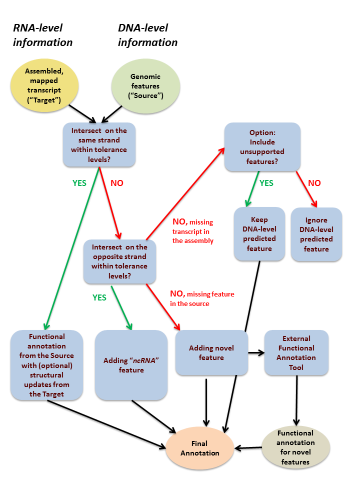

# annTrans
annTrans is an annotation transfer tool designed to annotate de novo transcriptome assemblies. 

The tool incorporates flexibility level needed for applications in a wide range of biological contexts, from annotating of a new genome to generating a more accurate genome annotation of a well-studied model organism. 

To achieve this flexibility, annTrans combines:    

  a) leveraging of existing functional genome annotation for de novo assembly annotation;    
  b) incorporating functional predictions for novel genomic features;    
  c) tunable process of comparing the genomic features predicted on the basis of DNA- and RNA-level data.     
  
  
The detailed usage instructions will appear on this page after revising of the algorithm according to the updated scheme (below) and the extensive testing. 
  

